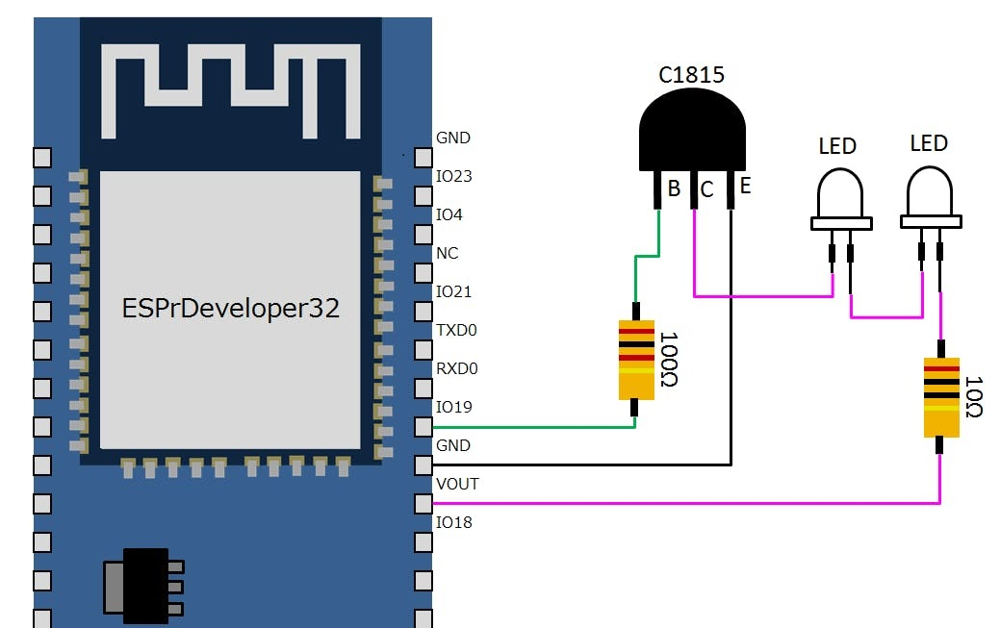

# esp32_alexa_light_control

Example for room light controller with Alexa

※It only supports The NEC IR transmission protocol

## Requirement

- Arduino IDE Version: 1.8.5
- [ESPr® Developer 32](https://www.switch-science.com/catalog/3210/)
- Alexa echo dot(3rd generation)
- Electric Parts(see 'Pin connections')

##  Pin connections

  


## Usage

1. Install Arduino libraries:
   - FauxmoESP(ver.3.1.0)　※1
   - AsyncTCP(ver.1.1.1)　 ※1
   - IRremoteESP8266(ver.2.6.6)　※2  

1. Set the SSID & password: 
```
char ssid[] = "";
char password[] = "";
```

3. Set the IR signal code(32bit):
```
      case LIGHT_ON:
        Serial.println("LIGHT ON");
        irsend.sendNEC(0x1768800,32); // ON
        alexa_event = NO_EVENT;
        break;
      case LIGHT_OFF:
        Serial.println("LIGHT OFF");
        irsend.sendNEC(0x17688FF,32); // OFF
```

4. Programming to ESP32

1. Connect Devices to Alexa: [document](https://www.amazon.com/gp/help/customer/display.html?nodeId=201749240)

1. Just say, "Alexa. ライト ON" or "Alexa. ライト OFF" ※3  
　  
※1: Download as zip from releases and import to Arduino IDE (open in toolbar Sketch -> Include Library -> Add .ZIP Library...)  
　  
※2: Open in toolbar Sketch -> Include Library -> Manage Libraries...  
　  
※3: If you want to change keyword（ライト）, change code:

```
    fauxmo.addDevice("ライト");
    
    fauxmo.onSetState([](unsigned char device_id, const char *device_name, bool state, unsigned char value) {
      //  If you have to do something more involved here set a flag and process it in your main loop
      Serial.printf("Device #%d (%s) state: %s value: %d\n", device_id, device_name, state ? "ON" : "OFF", value);
      if (strcmp(device_name, "ライト") == 0) {
```

## Rreferences
 - https://lang-ship.com/blog/?p=886
 - https://yubeshicat.hatenablog.com/entry/2019/01/08/010643
 - https://kuracux.hatenablog.jp/entry/2018/09/21/230649
 
